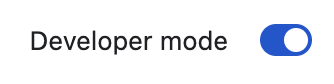
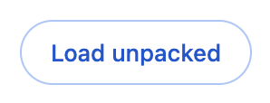
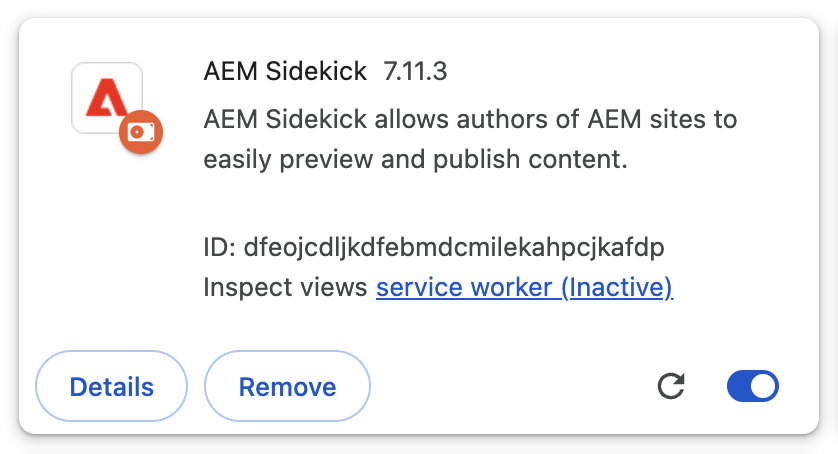

# AEM Sidekick

> Browser extension for authoring AEM sites

## Status
[](https://codecov.io/gh/adobe/aem-sidekick)

[](https://github.com/adobe/aem-sidekick/blob/master/LICENSE.txt)
[](https://github.com/adobe/aem-sidekick/issues)
[](https://github.com/semantic-release/semantic-release)

## Installation

1. Go to the [Chrome Web Store](https://chromewebstore.google.com/detail/aem-sidekick/igkmdomcgoebiipaifhmpfjhbjccggml)
1. Click _Add to Chrome_
1. Confirm by clicking _Add extension_
1. Click the extensions icon next to Chrome's address bar to see a list of all extensions:<br />

1. Verify that there's an icon like this:<br />
<br />
1. Click the pin button next to it to make sure it always stays visible.

## Development

### Install Dependencies

```bash
$ npm install
```

### Build and Test Locally

1. Start the development server to trigger a build on each code change:
   ```
   $ npm run build:watch
   ```
1. Open Chrome and navigate to `chrome://extensions`
1. Turn on _Developer mode_ at the top right of the header bar<br />

1. Click the _Load unpacked_ button in the action bar<br />

1. Navigate to the `dist > chrome` folder and click _Select_ to install and activate the Sidekick extension.
1. Verify that your _Extensions_ page displays a card like this:<br />
<br />
1. Click the extensions icon next to Chrome's address bar to see a list of all extensions:<br />

1. Verify that there's an icon like this:<br />
<br />
1. Click the pin icon next to it to make sure it always stays visible.

#### Code Changes

- Keep `npm run build:watch` running during development. The build usually takes between 1 and 3 seconds.
- Changes to the application (everything under `app`) require a reload of the tab.
- Changes to the service worker (`background.js` and its includes) require a reload of the extension by clicking the reload icon on the extension card.


### Run All Tests

```bash
$ npm test
```

### Debug Browser Tests

```bash
$ npm run test:watch
```

### Lint

```bash
$ npm run lint
```

### Build All

```bash
$ npm run build
```

### Build Chrome

```bash
$ npm run build:chrome
```

...

## Deployment

...
